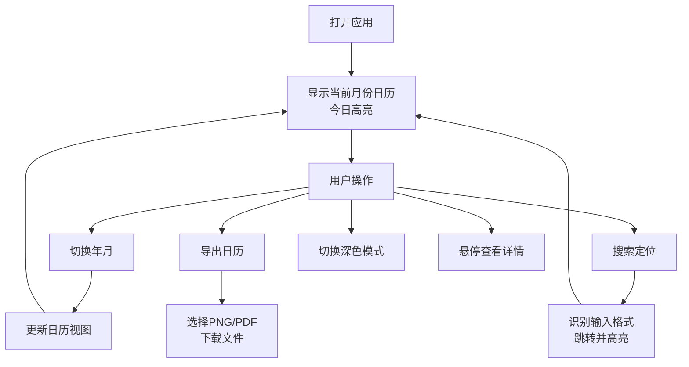

## 1. 产品概述

周期日历是一款基于特殊周期规则的网页日历应用，支持周期号标注、农历显示、节假日查询、快速搜索定位、数据导出等功能，提供深色模式和键盘快捷操作。主要面向需要按特殊周期规则管理时间的企业员工、项目管理人员和个人时间规划者。

产品价值在于提供清晰直观的周期号可视化展示，帮助用户快速定位日期对应的周期，高效进行时间规划和项目排期。

## 2. 核心功能

### 2.1 用户角色
无角色区分，所有用户拥有完全相同的功能权限。

### 2.2 功能模块
1. **顶部工具栏**：年份切换、月份切换、今日定位、搜索框、导出按钮、深色模式切换
2. **日历主体**：星期标题行、日期单元格（含周期号、公历日期、农历/节假日/节气、调休标注）
3. **底部图例**：周期号说明、节假日标识、调休补班标识、休假标识、作者标识
4. **键盘快捷键**：方向键切换年月、T键跳转今日、D键切换深色模式、/键聚焦搜索

### 2.3 页面详情

| 页面名称 | 模块名称 | 功能描述 |
|-----------|-------------|---------------------|
| 主页面 | 顶部工具栏 | 年份/月份选择器带下拉列表、今日按钮快速定位、搜索框支持周期号和日期格式、导出下拉菜单（PNG/PDF）、深色模式切换按钮 |
| 主页面 | 日历主体 | 左侧周期号列（蓝色椭圆标签，周日行显示）、星期标题行（周日到周六）、日期网格（公历+农历/节日+调休标识）、今日蓝色边框高亮、悬停浮层显示详细信息 |
| 主页面 | 底部图例 | 周期号示例说明、节假日名称示例、橙色「班」字示例、灰色「休」字示例、by小马署名 |
| 主页面 | 键盘快捷键 | 左右键切月、上下键切年、T键今日、D键深色模式、/键搜索聚焦 |

## 3. 核心流程

用户打开应用后默认显示当前月份日历，今日单元格蓝色边框高亮。用户可通过顶部工具栏切换年月、搜索定位、导出日历或切换深色模式。鼠标悬停日期可查看详细信息。支持键盘快捷操作提升效率。

## 4. 用户界面设计

### 4.1 设计风格
- **主色调**：蓝色系（#3B82F6 为主色），用于周期号标签、今日高亮、交互元素
- **辅助色**：橙色（#F59E0B）用于调休补班标识，灰色用于休假标识
- **背景**：浅色模式下为纯净白色，深色模式下为深灰（#1F2937）
- **字体**：现代无衬线字体，清晰易读
- **布局**：卡片式布局，圆角设计，柔和阴影
- **动效**：平滑过渡动画，悬停微交互

### 4.2 页面设计概述

| 页面名称 | 模块名称 | UI元素 |
|-----------|-------------|-------------|
| 主页面 | 顶部工具栏 | 白底/深灰底卡片、圆角按钮、下拉选择器、搜索输入框、图标按钮、hover状态过渡 |
| 主页面 | 日历主体 | 网格布局、左侧周期号列（蓝色椭圆标签）、日期单元格内信息层级清晰、今日蓝色边框、周末日期灰色调、悬停浮层带阴影 |
| 主页面 | 底部图例 | 横向排列、图标+文字说明、小号字体、by小马署名右对齐 |

### 4.3 响应式
- 桌面端优先设计，日历网格完整展示
- 平板端自适应缩放
- 移动端精简布局，周期号列可缩小或合并
- 触摸优化：加大点击区域

### 4.4 深色模式
- 背景：#111827 / #1F2937
- 文字：#F9FAFB / #D1D5DB
- 边框：#374151
- 主色保持蓝色调，调整亮度保证对比度
- 切换动画：0.3s ease 平滑过渡
