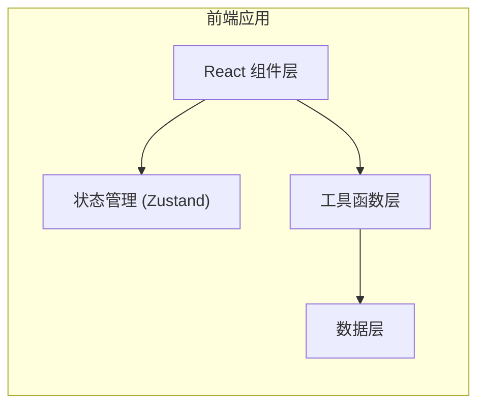

## 1. 架构设计



## 2. 技术描述
- **前端框架**：React@18 + TypeScript + Vite
- **样式方案**：TailwindCSS@3
- **状态管理**：Zustand
- **图标库**：lucide-react
- **导出功能**：html2canvas（PNG导出）+ jspdf（PDF导出）
- **后端**：无（纯前端应用）
- **数据库**：无（内置静态数据）

## 3. 路由定义
| 路由 | 用途 |
|-------|---------|
| / | 主页面 - 周期日历展示 |

## 4. 数据模型

### 4.1 日历日期对象
```typescript
interface CalendarDate {
  date: Date;           // 公历日期
  day: number;          // 日期数字
  isCurrentMonth: boolean; // 是否属于当前月份
  isToday: boolean;     // 是否今日
  cycleNumber: string;  // 周期号，如 "2605"
  lunarDate: string;    // 农历日期
  lunarFestival?: string; // 农历节日
  solarFestival?: string; // 公历节日
  solarTerm?: string;   // 节气
  isHoliday?: boolean;  // 是否法定节假日
  isWorkDay?: boolean;  // 是否调休补班
  weekDay: number;      // 星期几（0=周日）
}
```

### 4.2 日历状态
```typescript
interface CalendarState {
  currentYear: number;
  currentMonth: number; // 0-11
  selectedDate: Date | null;
  highlightedWeek: string | null; // 高亮的周期号
  darkMode: boolean;
}
```

### 4.3 节假日数据
```typescript
interface HolidayInfo {
  date: string;        // YYYY-MM-DD
  name: string;        // 节假日名称
  isHoliday: boolean;  // 是否休假
  isWorkDay: boolean;  // 是否补班
}
```

## 5. 核心工具函数

| 函数名 | 用途 |
|-------|------|
| `getCycleNumber(date)` | 计算指定日期的周期号 |
| `getCycleDateRange(cycleNumber, year)` | 获取周期号对应的起止日期 |
| `getLunarDate(date)` | 公历转农历 |
| `getSolarTerm(date)` | 获取节气 |
| `getHolidayInfo(date)` | 获取节假日信息 |
| `generateCalendarDays(year, month)` | 生成当月日历数据 |
| `parseSearchInput(input)` | 解析搜索输入（周期号/日期） |
| `exportAsPNG(element, filename)` | 导出为PNG图片 |
| `exportAsPDF(element, filename)` | 导出为PDF文件 |

## 6. 组件结构

```
src/
├── components/
│   ├── Toolbar/           # 顶部工具栏
│   │   ├── YearSelector.tsx
│   │   ├── MonthSelector.tsx
│   │   ├── TodayButton.tsx
│   │   ├── SearchBox.tsx
│   │   ├── ExportButton.tsx
│   │   └── DarkModeToggle.tsx
│   ├── Calendar/          # 日历主体
│   │   ├── WeekHeader.tsx
│   │   ├── DateCell.tsx
│   │   ├── CycleNumberColumn.tsx
│   │   └── CalendarGrid.tsx
│   ├── Legend/            # 底部图例
│   │   └── LegendBar.tsx
│   └── common/            # 通用组件
│       └── Tooltip.tsx
├── hooks/
│   ├── useCalendar.ts     # 日历逻辑hook
│   ├── useDarkMode.ts     # 深色模式hook
│   └── useKeyboardShortcuts.ts # 键盘快捷键hook
├── utils/
│   ├── cycle.ts           # 周期计算
│   ├── lunar.ts           # 农历转换
│   ├── holidays.ts        # 节假日数据
│   └── export.ts          # 导出功能
├── data/
│   ├── holidays2026.ts    # 2026年节假日
│   ├── holidays2027.ts    # 2027年节假日
│   └── solarTerms.ts      # 节气数据
├── store/
│   └── useCalendarStore.ts # Zustand状态管理
├── App.tsx
├── main.tsx
└── index.css
```
